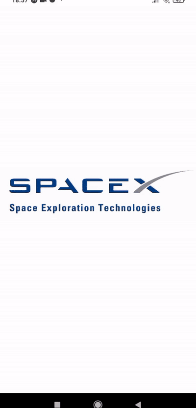

# RN-fatCat-test

The app serves a purpose as a test.

## Tasks

- Eslint usage. :heavy_check_mark:
- TypeScript usage. :heavy_check_mark:
- Camera access permission. :heavy_check_mark: [here from line 36](screens/CrewMember.tsx)
- No internet connection. :heavy_check_mark: [here from line 14](App.tsx)
- API server not working. :heavy_check_mark: [here from line 34](screens/CrewMembers.tsx), [here from line 32](screens/Rockets.tsx) and [here](hooks/useFetch.ts) 

## Extra Features

- Swipe through rockets in Rockets Screen.
- Zoom rocket image on touch.
- Switch between imperial and metric units.
- Rendering astronaut silhouette when permissions are denied.
- Search astronauts based on name or agency.
- Show more/less functionality

